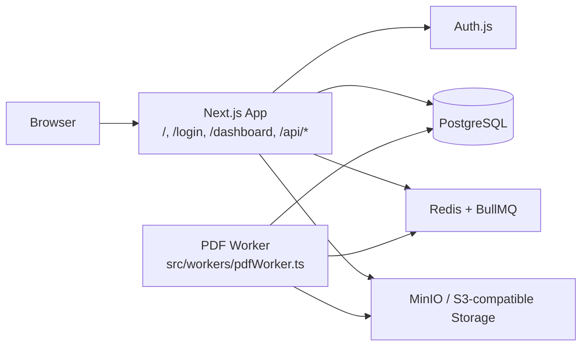

# ulazytools.online

Production-oriented local development guide for the `ulazytools.online` app. This README is designed to get a new developer from clone to a working web app, worker, and local infrastructure with minimal confusion.

## Overview

`ulazytools.online` is a Next.js 14 App Router application backed by Prisma, PostgreSQL, Redis, and MinIO for local object storage. The app currently includes:

- Public marketing UI at `/`
- Google sign-in via Auth.js
- Protected app area at `/dashboard`
- Background PDF job processing through BullMQ and a dedicated worker
- Structured logging with request correlation through `x-request-id`

The main local goal is a green state where:

- Docker services are healthy
- `.env.local` is configured
- the web app is running at `http://localhost:3000`
- the worker is running in a second terminal
- `GET /api/health` returns `ok`
- tests and typecheck pass

## Architecture



Runtime flow:

1. A user loads the Next.js app and authenticates through Auth.js when needed.
2. Server-side app code reads and writes application data through Prisma to PostgreSQL.
3. Job-producing server code can enqueue background work through BullMQ on Redis.
4. `src/workers/pdfWorker.ts` pulls queued jobs and processes them outside the web request path.
5. Storage helpers talk to local MinIO through S3-compatible APIs.
6. Structured logs carry request correlation through `x-request-id`, and queue producers should pass `requestId` into `enqueuePdfJob(...)` for end-to-end tracing.

## Tech Stack

- Next.js 14 App Router
- React 18
- TypeScript
- Auth.js with Prisma adapter
- Prisma ORM
- PostgreSQL 16
- Redis 7
- BullMQ
- MinIO for local S3-compatible storage
- Jest + Testing Library
- Pino for structured logging

## Prerequisites

- Node.js 18 or newer
- npm
- Docker Desktop with Docker Compose
- A Google OAuth app for local sign-in testing

Optional but useful:

- MinIO Console access in the browser
- `mc` CLI if you prefer bucket setup by command line

## Environment Setup

Copy the example environment file:

```powershell
Copy-Item .env.local.example .env.local
```

```bash
cp .env.local.example .env.local
```

Then update `.env.local`.

Required values to fill in:

- `AUTH_SECRET`
- `AUTH_GOOGLE_ID`
- `AUTH_GOOGLE_SECRET`

The example file already includes local defaults for:

- `DATABASE_URL`
- `DIRECT_URL`
- `REDIS_URL`
- `S3_ENDPOINT`
- `S3_REGION`
- `S3_ACCESS_KEY_ID`
- `S3_SECRET_ACCESS_KEY`
- `S3_BUCKET`
- `S3_FORCE_PATH_STYLE`

For Google OAuth, register this local callback URL exactly:

```text
http://localhost:3000/api/auth/callback/google
```

For non-local deployments, also set `AUTH_URL` or `NEXTAUTH_URL` to the deployed origin.

## Docker Setup

Start local infrastructure:

```powershell
docker compose up -d
docker compose ps
```

```bash
docker compose up -d
docker compose ps
```

Local services:

- Postgres 16 on `localhost:5432`
- Redis 7 on `localhost:6379`
- MinIO API on `http://localhost:9000`
- MinIO Console on `http://localhost:9001`

Stop the stack:

```powershell
docker compose down
```

```bash
docker compose down
```

If you need to wipe local Postgres and MinIO data:

```powershell
docker compose down -v
```

```bash
docker compose down -v
```

## MinIO Bucket Setup

Use `ulazy-pdf-dev` as the local bucket name.

Browser flow:

1. Open `http://localhost:9001`
2. Sign in with username `ulazytools`
3. Sign in with password `ulazytools-minio-secret`
4. Create a bucket named `ulazy-pdf-dev`

Optional `mc` CLI flow:

```powershell
mc alias set local http://localhost:9000 ulazytools ulazytools-minio-secret
mc mb local/ulazy-pdf-dev
```

If `local` is already taken as an alias on your machine, choose another alias name and use it consistently.

## Install Dependencies

Install application dependencies after the environment file exists:

```powershell
npm install
```

```bash
npm install
```

## Database and Prisma Setup

This repo already contains Prisma migrations under `prisma/migrations/`.

Recommended local Prisma checks:

```powershell
npm run prisma:generate
npm run prisma:validate
```

```bash
npm run prisma:generate
npm run prisma:validate
```

Optional database inspection:

```powershell
npm run prisma:studio
```

```bash
npm run prisma:studio
```

If your normal local workflow applies migrations after infrastructure is ready, run that standard Prisma step at this point before starting the app.

## Running the App

Run the web app and worker in separate terminals.

Terminal 1, web app:

```powershell
npm run dev
```

```bash
npm run dev
```

Terminal 2, worker:

```powershell
npm run worker:dev
```

```bash
npm run worker:dev
```

After startup:

- open `http://localhost:3000`
- public marketing page is available at `/`
- protected app area starts at `/dashboard`
- unauthenticated access to `/dashboard` redirects to `/login`

## Testing and Verification

Run the main local checks:

```powershell
npm test
npm run typecheck
```

```bash
npm test
npm run typecheck
```

Useful additional checks:

```powershell
npm run build
npm run verify
```

```bash
npm run build
npm run verify
```

Smoke-check the health endpoint:

```powershell
Invoke-WebRequest http://localhost:3000/api/health | Select-Object -ExpandProperty Content
```

```bash
curl http://localhost:3000/api/health
```

Expected result:

- JSON response containing `status: "ok"`
- a `requestId` field in the response body
- an `x-request-id` response header on matched requests

## Green State Checklist

- [ ] `.env.local` created from `.env.local.example`
- [ ] Docker services started and healthy
- [ ] MinIO bucket `ulazy-pdf-dev` created
- [ ] Dependencies installed with `npm install`
- [ ] Prisma client generated and schema validated
- [ ] Web app running at `http://localhost:3000`
- [ ] Worker running in a second terminal
- [ ] `GET /api/health` returns `ok` with `requestId`
- [ ] `npm test` passes
- [ ] `npm run typecheck` passes

## Available Scripts

- `npm run dev` starts the Next.js development server
- `npm run worker:dev` starts the PDF worker with `.env.local`
- `npm run build` builds the Next.js app
- `npm start` runs the production server
- `npm test` runs Jest tests in band
- `npm run typecheck` runs TypeScript with the dedicated typecheck project
- `npm run lint` runs the Next.js ESLint configuration
- `npm run verify` runs typecheck, lint, and build together
- `npm run prisma:generate` generates the Prisma client using `.env.local`
- `npm run prisma:validate` validates the Prisma schema using `.env.local`
- `npm run prisma:studio` opens Prisma Studio using `.env.local`
- `npm run storage:verify` runs the storage verification script with `.env.local`
- `npm run format` writes Prettier formatting
- `npm run format:check` verifies Prettier formatting
- `npm run ci:smoke` runs the runtime smoke script

## Common Issues and Fixes

### Docker Desktop is not running

Symptoms:

- `docker compose up -d` fails immediately
- services never start

Fix:

- start Docker Desktop
- rerun `docker compose up -d`

### Port collision on 3000, 5432, 6379, 9000, or 9001

Symptoms:

- Docker services fail to bind
- Next.js cannot start on port 3000

Fix:

- stop the conflicting process or container
- if needed, change the mapped host port in `docker-compose.yml`
- update `.env.local` to match any changed DB or Redis port

### Missing `.env.local`

Symptoms:

- env validation errors during startup
- auth, Redis, or storage config failures

Fix:

- create `.env.local` from `.env.local.example`
- confirm required auth values are filled in

### Google OAuth redirect mismatch

Symptoms:

- sign-in fails after redirecting to Google

Fix:

- verify the callback URL is exactly `http://localhost:3000/api/auth/callback/google`
- confirm `AUTH_GOOGLE_ID` and `AUTH_GOOGLE_SECRET`
- for non-local environments, confirm `AUTH_URL` or `NEXTAUTH_URL`

### MinIO bucket missing

Symptoms:

- storage operations fail even though MinIO is running

Fix:

- create `ulazy-pdf-dev` in the MinIO Console or with `mc`
- confirm `S3_BUCKET` in `.env.local` matches the bucket you created

### Prisma client or schema issues

Symptoms:

- Prisma-related runtime errors
- schema validation failures

Fix:

```powershell
npm run prisma:generate
npm run prisma:validate
```

```bash
npm run prisma:generate
npm run prisma:validate
```

### Local queue jobs disappear after Redis restart or flush

Symptoms:

- queued jobs never reach the worker
- local queue state disappears unexpectedly

Fix:

- keep Redis running while testing worker flows
- re-enqueue jobs after a Redis flush or restart

## Apple Silicon Notes

- This stack is Docker-friendly on Apple Silicon, but image pulls and native tooling can still vary by machine.
- If a dependency with native bindings behaves differently on Apple Silicon, prefer the project’s normal npm workflow first before adding platform-specific install flags.
- If you hit an architecture-specific issue, document the exact package and failure in the PR or issue so the repo can adopt a stable team-wide fix instead of one-off local commands.

## Additional Resources

### Project structure

```text
.
|-- prisma/
|-- src/
|   |-- app/
|   |-- components/
|   |-- lib/
|   |-- server/
|   `-- workers/
|-- package.json
`-- tsconfig.json
```

- `src/app/` contains Next.js App Router entrypoints and route-level UI
- `src/components/` contains reusable interface components
- `src/lib/` contains shared helpers and cross-cutting utilities
- `src/server/` contains server-only orchestration and backend infrastructure code
- `src/workers/` contains background job processors and worker runtime code
- `prisma/` contains the schema and migrations

### Import conventions

Use `@/` imports for modules under `src/`. For example, `@/components/ui` resolves to `src/components/ui`.

Keep server-only code under `src/server/` so it does not leak into client bundles by accident.

### Auth and route behavior

- public landing page is `/`
- sign-in page is `/login`
- protected app area starts at `/dashboard`
- middleware applies the early redirect behavior for `/dashboard`

### Observability baseline

- the shared logger entrypoint lives in `src/lib/logger.ts`
- matched app and API requests receive an `x-request-id` response header
- queue producers should pass `requestId` into `enqueuePdfJob(...)` when work originates from an HTTP request
- `GET /api/health` is the lightweight smoke-check endpoint for request correlation

### Security note

The app includes baseline security headers through `next.config.mjs`. Treat that file as the source of truth for current response hardening policy.
